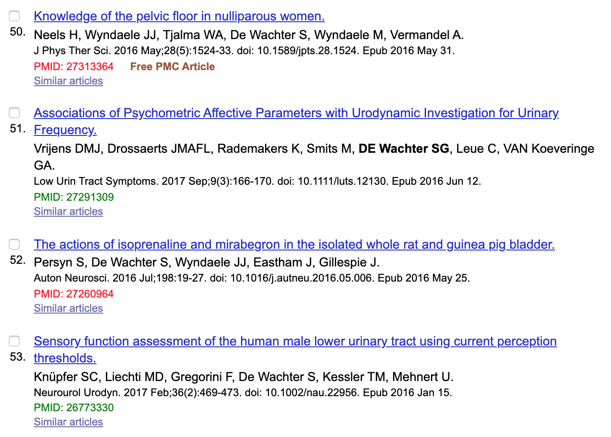

# ST_in_library_browser

This repo is currently a work in progress. The goal is to support browsing journals and Pubmed while letting you know if you have articles in your library.

I currently have a working exampple although this may change and requires using Mendeley and my [Mendeley client library](https://github.com/ScholarTools/ST_mendeley_python).

```python
from in_library_browser import browser
b = browser.PubmedBrowser()
#Search for something then run the command below
b.paint()
```




